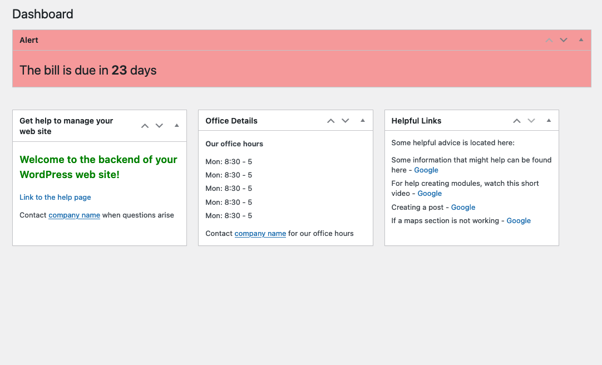

<!-- PROJECT LOGO -->
 

	
  	<h3 align="center">Fine Dashboard Source</h3>
 	 

    	A source for your custom dashboard!
   		 
 	 

<!-- ABOUT THE PROJECT -->
## About The Project
If you want to create a custom Wordpress dashboard use this to send data to the client dashboard.

 
 

	</img>

 
 
 

<!-- USAGE EXAMPLES -->
## Usage

Install this plugin to control the client plugin data. Install the "Fine Dashboard - Client" on the wordpress instance you want to replace the dashboard.

 
 
 

<!-- CONTACT -->
## Contact
Luke Ketchen - [lukeketchen.com](http://lukeketchen.com/)
 
Project Link: [github.com/lukeketchen/fine-dashboard-source](https://github.com/lukeketchen/fine-dashboard-source)

 
 
 

<!-- ACKNOWLEDGMENTS -->
## Acknowledgments
[Dashboard icons created by Slidicon - Flaticon](https://www.flaticon.com/free-icons/dashboard)

(<a href="#top">back to top</a>)

